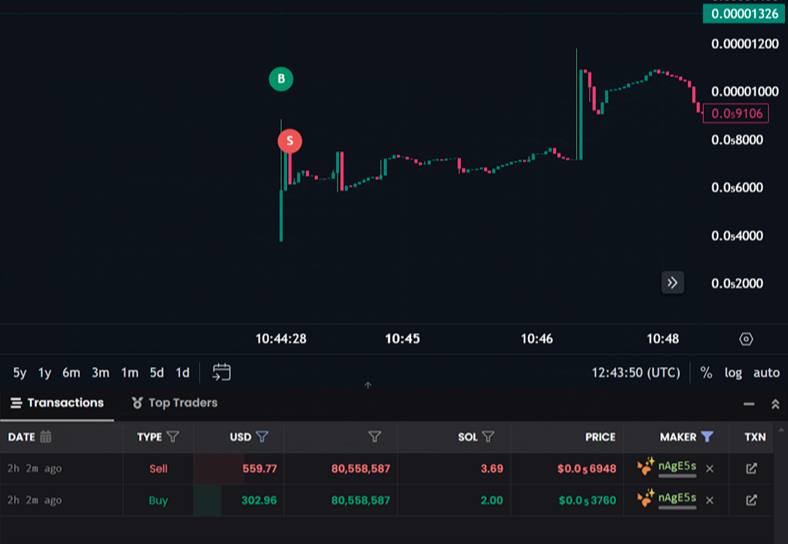

## Pump Fun Sniper Bot - Lightning Fast-Speed Automated Sniping for Pump.Fun Tokens & Selling For Profit (Updated December 2024)

SoFump The New Latest Pump Fun Sniper Bot is a cutting-edge tool designed for lightning fast automated buying on Pump.Fun tokens. This bot detects new liquidity pools, executes trades, and and sell at a price increase to maximize profits with features like automated buying, take-profit/stop-loss settings, and persistent positions, even in Rug Coins!  

Boost your crypto trading game with SoFump PumpFun Sniper Bot, the ultimate Solana-based trading tool. Detect new Pump.Fun liquidity pools instantly, automate trades, and maximize profits with advanced take-profit and stop-loss settings. Perfect for degens trading SOL, USDC, WSOL, and more. Fast, reliable, and customizable for beginners and pros alike—dominate the market with this top-tier Solana sniper bot!


## *Why Choose Sofump Pump Fun Sniper Bot?*
- The Only ORIGINAL Pump Fun Sniper Bot which has other low quality slow Imitators.
- Added & Updated With The Latest Optimizations & Features
- Highest-speed detection of new Pump.Fun liquidity pools.
- Automatic trading based on customizable settings, to be rug proof.
- Easy-to-use interface for beginners and advanced users.

> *DISCLAIMER*: Use this bot responsibly.

---

## Features

- *Automated Trading*: Snipes the latest coins on Pump.Fun before anybody else and automates sell actions based on your target profit settings.
- *King of the Hill Mode*: Prioritize top-performing Kint Of Hill coins sniping before anyone else and selling for maximum potential returns.
- *Customizable Settings*: Adjust settings like minimum market cap, reply counts, and more, to be rug proof.
- *Advanced Monitoring*: View detailed information about the latest coins and manage your portfolio efficiently.
- Example Snipe Of A PumpFun Token That Bonded & Went to Raydium


---

## Setup Instructions

### *1. Prerequisites*
- Use Your Solana wallet which you use to trade tokens (SOL or USDC/WSOL).
- A private RPC endpoint (Helius/Quicknode recommended for speed, make an account with them for free).
- Node.js installed on your system.
- I Recommend having 10x the amount of SOL you will be using per trade in your wallet, to ensure seamless sniping and no disruptions at all in regards to transaction fees and stuff.

---

## *2. Installation*

1. Clone the repository:  
   ```git clone https://github.com/SOLPumpFunBot/LATEST-Solana-Pump-Fun-Sniper-Trading-Bot```
2. Navigate to the directory: ```cd (Bot File Path)```
3. Install dependencies: ```npm install```
4. Start ```npm start```

---

## *3. Configuration*

1. Change the .env.example file to .env and then open it & update the values:

   - PRIVATE_KEY: Your wallet's private key.
   - RPC_URL: Your Solana RPC URL.
   - Other customizable parameters like TAKE_PROFIT, STOP_LOSS, and more.
   
3. Example configuration:
   
  - PRIVATE_KEY=your_private_key_here
  - RPC_URL=https://your-fast-rpc-endpoint.com
  - MIN_MARKET_CAP=500000
  - TAKE_PROFIT=20
  - STOP_LOSS=10

---

### Setting Up

1. Run the tool with npm start.
2. Select "Set settings" from the menu to configure your bot settings including:
   - Minimum Market Cap
   - Minimum Reply Count
   - Require Telegram
   - Require Website
   - Require Twitter
   - Require Revoked Mint Authority and Freeze Authority
   - Enable Auto Buy
   - Set Buy Amount
   - Enable Take Profit
   - Set Take Profit Percentage
   - Enable Stop Loss
   - Set Stop Loss Percentage

### Using the Tool

- **Purchase the Latest Coin:** Buy the latest coin that meets your requirements and sell off for quick profit, even in rugcoins. (This is probably the reason you would be using this bot)
  
- **View Positions:** View your current positions and manage them, including selling all positions.
- **Set Settings:** Configure the bot settings.
- **Exit:** Exit the tool.

Enjoy automated trading with Pump-Fun-Sniper-Solana!


